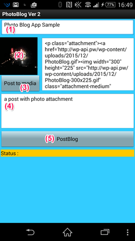

# Photoblog

## Project Title.
簡易Easy Photo Blog 投稿ツール

## Elevator Pitch.
このクラウド対応アプリは、スマートフォンの写真ギャラリーから写真を選び、自分のWordPressサイトのメデイアファイルに保存し，この写真を含める投稿を作成する.

## Description.
簡易Easy Photo Blog 投稿ツールはスマートフォンのアプリ、簡単に自分のWordPressサイトに、写真付き投稿するためのもの。次のステップで投稿する:

1. タイトル入力
1. 写真ギャラリーから写真を選び
1. “Post to media”ボタンを押し、WordPressサイトのメデイアファイルに保存する
1. 投稿する内容を入力する
1. “Post Blog”ボタンを押し、写真付き投稿を完了する .

このアプリは、自分のWordPressサイトに写真付き投稿を楽にするものである.

このアプリにもたらす社会的利益は、写真付き投稿が迅速、簡単にできるため、あとでゆっくり見直すできるので, 人々にたくさん投稿するモチベーションを与えること. これも [WordPress REST API](http://wp-api.org/)　使うためのいい実例になる.

## Download and Test.
このアプリは WordPress REST API使うため, 全ての機能をテストするには、WordPressにREST APIを入れる必要. こちらの[テストサイト](http://wp-api.pw/)を自由に利用しても構わない. アプリをダウンロードするには、MIT AI2 Companionアプリまたはスキャナーアプリを使っでQRコードをスキャンして、 または [このダウンロードリンクをクリックする](https://sites.google.com/site/chen420/my-apk/PhotoBlog%20%281%29.apk?attredirects=0&d=1).

a screen shot show a post on WordPress REST API powered Blog site.

## Technical Description.
As shown in this screenshot, the app exceeds the project’s minimum technical requirements. It contains 2 global variables, 4 list data, 2 procedures or functions, and 2 if/else structure.

## Appendix.

The WP REST API is a WordPress plugin that intends to be eventually integrated into WordPress’ core as another (big) step towards transforming WordPress from a blogging platform/CMS into a fully fledged application framework.

WP REST API provide OAuth 1.0a and Basic Auth algorithm. it is no way to use OAuth 1.0a on App Inventor, so I use Basic Auth on this app. Basic Auth use base64 encode and not way to do on App Inventor, so on this app, just use a global variable to store a text which already encoded auth text.
