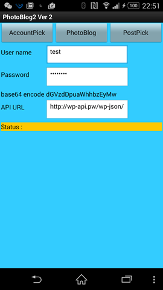

# 簡易Easy Photo Blog 投稿ツール強化版

## Project Title.
簡易Easy Photo Blog 投稿ツール強化版 (Enhanced photo blog publisher)

## Elevator Pitch.
“Enhanced photo blog publisher” はクラウド対応、簡単に写真付き投稿するためのアプリ, 投稿ビューア、カスタム認証、base64 encode 実装など、強化されたバージョンである。

## Description.
簡易Easy Photo Blog 投稿ツールはスマートフォンのアプリ、簡単に自分のWordPressサイトに、写真付き投稿するためのもの。下記の機能を強化れた:
1.	投稿ビューアで最近の投稿が見れる。
2.	カスタム認証画面で、いくつWordPress REST APIのサービスを含めるリストを管理可能.

このアプリにもたらす社会的利益は、写真付き投稿が迅速、簡単にできるため、あとでゆっくり見直すできるので, 人々にたくさん投稿するモチベーションを与えること. これも [WordPress REST API](http://wp-api.org/)　使うためのいい実例になる.

WordPress REST API対応WordPressサイトに投稿した内容の画面コピー

## Download and Test.
このアプリは WordPress REST API使うため, 全ての機能をテストするには、WordPressにREST APIを入れる必要. こちらの[テストサイト](http://wp-api.pw/)を自由に利用しても構わない. アプリをダウンロードするには、MIT AI2 Companionアプリまたはスキャナーアプリを使っでQRコードをスキャンして、 または [このダウンロードリンクをクリックする](https://sites.google.com/site/chen420/my-apk/PhotoBlog%20%281%29.apk?attredirects=0&d=1).

## Technical Description.
下記の画面コピーにあるように、このアプリはプロジェクトの最低限仕様を満たした。中に 2 個グローバル変数（global variables）, 4 個リストデータ（list data）, 2個関数（procedures or functions）, そして 2 個if/else 構造（structure）が含まれた。

##   Appendix.

WP REST APIはWordPressのプラグイン、 将来は WordPressコアに組み入れ、WordPressを ブログプラットフォーム/CMS から、本格的なアプリケーション・フレームワークへ変身するために一歩である。サービスを運用するために、自前の WordPress サイトに次の２つプラグインを入れてください:
1.	WP REST API plugin, インストールと有効化 (WP 4.4 と WP 4.5でコアに取り入れる予定)
2.	BASIC Auth plugin, git clone https://github.com/WP-API/Basic-Auth basicAuth, して有効化.
