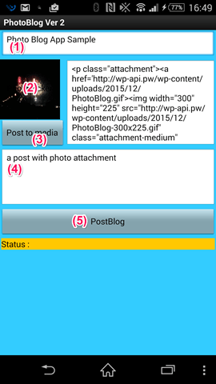

# Photoblog

## Project Title.
Easy Photo Blog publisher

## Elevator Pitch.
This cloud app pickup a photo from device’s image gallay, save the photo on self hosted WordPress site as a media file，and create a post with the media file attachement.

## Description.
The Easy Photo Blog publisher is a mobile app that make easy to publish a post with photo to self hosted WordPress site. To make a post, user could follow steps:

1. Type the post title
1. Pickup a photo from device’s image gallay.
1. Press “Post to madia” button to save the photo on WordPress site as a media file
1. Type the post main content
1. Press “Post Blog” to create a post with the media file attachement.

the app is easy way to make a photo blog to own WordPress site.

The app’s social benefit comes from its ability to make a quick post, and improve later, give a motivation to help user more publish. Also this a good example to use [WordPress REST API](http://wp-api.org/).

## Download and Test.
Because this is a app using WordPress REST API, the only way to fully test its functionality would require using the WordPress REST API powered Blog site. You can feel free to use my test site. To download the app, scan the QR code to the left with the MIT AI2 Companion app or some other Scanner or [click on this download link](https://sites.google.com/site/chen420/my-apk/PhotoBlog%20%281%29.apk?attredirects=0&d=1).

a screen shot show a post on WordPress REST API powered Blog site.

## Technical Description.
As shown in this screenshot, the app exceeds the project’s minimum technical requirements. It contains 2 global variables, 4 list data, 2 procedures or functions, and 2 if/else structure.

## Appendix.

The WP REST API is a WordPress plugin that intends to be eventually integrated into WordPress’ core as another (big) step towards transforming WordPress from a blogging platform/CMS into a fully fledged application framework.

WP REST API provide OAuth 1.0a and Basic Auth algorithm. it is no way to use OAuth 1.0a on App Inventor, so I use Basic Auth on this app. Basic Auth use base64 encode and not way to do on App Inventor, so on this app, just use a global variable to store a text which already encoded auth text.
