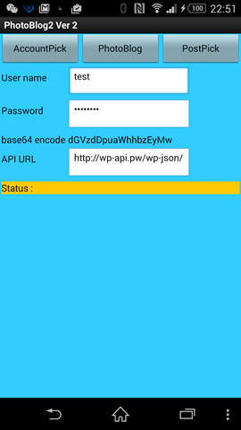
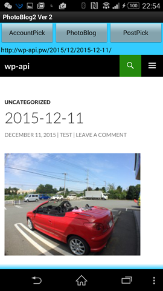
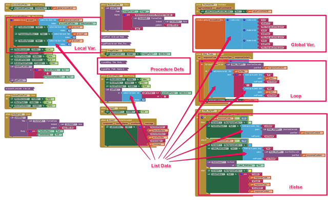

# Enhanced photo blog publisher

## Project Title.
Enhanced Photo Blog publisher

## Elevator Pitch.
“Easy Photo Blog publisher” is easy way to make a photo blog to own WordPress site, this cloud app enhanced with additional post viewer, custom Auth UI with base64 encode implement.

## Description.
The Easy Photo Blog publisher is a mobile app that make easy to publish a post with photo to self-hosted WordPress site.  Enhanced Photo Blog publisher was enhanced with following functions:
1.	Post viewers for you browse recent posts.
2.	A custom Auth UI let you manage a WordPress REST API service lists.

The app’s social benefit comes from its ability to make a quick post, and improve later, give a motivation to help user more publish. Also this is a good example to use [WordPress REST API](http://wp-api.org/).

A screen shot show a post on WordPress REST API powered Blog site with a Photoblog post.

## Download and Test.
Because this is an app using WordPress REST API, the only way to fully test its functionality would require using the WordPress REST API powered Blog site. You can feel free to use my test site. To download the app, scan the QR code to the left with the MIT AI2 Companion app or some other Scanner or [click on this download link](https://sites.google.com/site/chen420/my-apk/PhotoBlog%20%281%29.apk?attredirects=0&d=1).

## Technical Description.
As shown in this screenshot, the app exceeds the project’s minimum technical requirements. It contains 2 global variables, 4 list data, 2 procedures or functions, and 2 if/else structure.

##   Appendix.

### WP REST API web service
The WP REST API is a WordPress plugin that intends to be eventually integrated into WordPress’ core as another (big) step towards transforming WordPress from a blogging platform/CMS into a fully-fledged application framework.
To start a service, you have own a own WordPress site, and use 2 plugins:
1.	WP REST API plugin, install and active (schedule uptake to core WP 4.4 and WP 4.5)
2.	BASIC Auth plugin, git clone https://github.com/WP-API/Basic-Auth basicAuth, and active.
